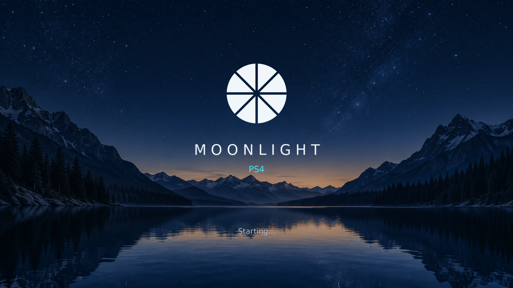
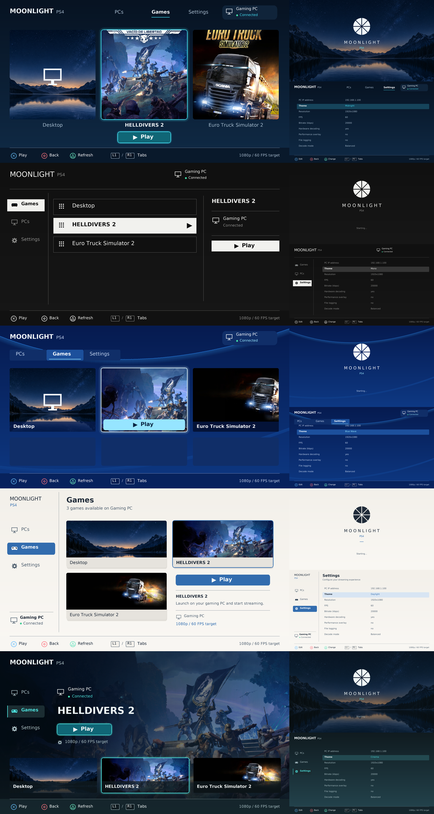

# Moonlight PS4

### Release 01.33 · Experimental

Stream your PC games to a jailbroken PS4 with Sunshine and a DualShock 4.

**[What's new](#whats-new-in-0133)** · **[Install](#installation)** · **[Controls](#controls)** · **[Known issues](#known-issues)**

> **Unofficial client:** Moonlight PS4 is independently developed. It is not
> affiliated with, endorsed by, or maintained by the official Moonlight project.
> Product names belong to their respective owners.

## What's new in 01.33

- Replaced the crescent splash mark with Moonlight's eight-segment logo in all five themes.
- Retains the Rec.709 color correction, Balanced presentation policy and
  presentation-queue diagnostics introduced in 01.32.

The package compiles and host tests pass. The new presentation policy still
needs validation on PS4; it may add latency under contention.

## Included features

- Local IPv4 mDNS discovery, manual IP entry and PIN pairing.
- Sunshine application list, launch/resume and Desktop streaming.
- H.264 hardware decoding, stereo Opus audio and DualShock 4 input.
- Five saved themes: **Midnight · Mono · Blue Wave · Daylight · Cinema**.
- Matching startup splashes, portrait covers and game panoramas.
- Optional Windows Steam-library companion.
- Balanced / Low latency modes, performance overlay and file logging.
- Return to the client menu and a controller shortcut for the host Guide button.

<strong>Preview the five themes</strong>

Images are previews produced by the actual C UI renderer on a development
PC, not PS4 captures. The previews show the 01.33 UI. Console screenshots
are pending; game artwork belongs to its respective owners.

## Installation

**Tested setup:** original PS4, firmware **9.00**, GoldHEN, DualShock 4 and an
Ethernet-connected PC running [Sunshine](https://github.com/LizardByte/Sunshine).
The Windows test host uses ViGEmBus for controller emulation.

- **Package:** `Moonlight-PS4-01.33-test.pkg`
- **Title ID:** `MLNT00001`
- **Settings:** `/data/moonlight`

No public download has been published for this fork yet. Build instructions
are in [docs/BUILD.md](docs/BUILD.md); Windows builds export the PKG and a
SHA256 manifest to `dist/`.

1. Install the PKG with GoldHEN's Package Installer. It updates an existing
   client using the same title ID and retains its saved settings.
2. Open **PCs** and press **Triangle** to discover your PC, or enter its IP in Settings.
3. Connect with **X**, then enter the displayed PIN in Sunshine's pairing page.
4. Select a game in **Games** and press **X** to play.

Start with **1080p · 60 FPS · 20,000 kbps · Hardware decoding · Balanced**.
For TruckersMP or another external launcher, choose **Desktop** and launch the
game on your PC. To publish installed Steam games automatically, follow
[Steam setup](docs/STEAM.md).

## Controls

| Input | Action |
| --- | --- |
| D-pad | Navigate |
| X / Circle | Confirm / back |
| Triangle | Discover PCs / refresh applications |
| L1 / R1 | Switch menu tabs |
| Options in Games | Close the active host session |
| L1 + R1 + Options while streaming | Send Guide to the host |
| Hold Options + Touchpad for about one second | Return to the client menu |

The physical PS button opens the PS4 system menu. Use the Guide shortcut for Steam.

## Known issues

- **Locked 60 FPS is not guaranteed.** An earlier ETS2 Desktop-stream sample
  averaged 58.5 client-reported FPS over about 8.5 minutes, with the final
  minutes near 59.9 FPS. Sunshine captured at 59.94 Hz.
- The 01.33 color correction and presentation changes need console comparison.
  The reported sharpening appearance has not been conclusively diagnosed.
- Compatibility beyond the original PS4 / firmware 9.00 setup is unverified.
- Discovery currently covers local IPv4; use manual IP if multicast is unavailable.
- Keyboard/mouse support and native YCbCr presentation remain unfinished.
- Steam auto-discovery requires the Windows companion. The PS4 reads Sunshine's
  catalog rather than scanning Steam directly.

Detailed measurements and the next test procedure:
[ETS2 performance analysis](docs/ETS2_01_32.md).
Experimental YCbCr plugins are outside the standard installation.

## Reporting a problem

Include client version, PS4 model/firmware, Sunshine version, network connection,
resolution, bitrate and reproduction steps. For stutters, enable **Performance
overlay** and **File logging**, and report timings and drops from the same scene.
Remove personal information from logs; do not share pairing keys or certificates.

## Credits

Based on [JaimeJimenezG/Moonlight-ps4](https://github.com/JaimeJimenezG/Moonlight-ps4),
using [moonlight-common-c](https://github.com/moonlight-stream/moonlight-common-c),
[OpenOrbis](https://github.com/OpenOrbis/OpenOrbis-PS4-Toolchain), Sunshine,
FFmpeg, Opus and mbedTLS. Dependency pins: [third_party/DEPS](third_party/DEPS).
Font notices: [vendor/FONT-LICENSE.txt](vendor/FONT-LICENSE.txt).
UI asset provenance: [design/ASSETS_01_31.md](design/ASSETS_01_31.md).

A top-level license and redistribution review remain pending before public
binary distribution. Existing dependency licenses and notices apply.
